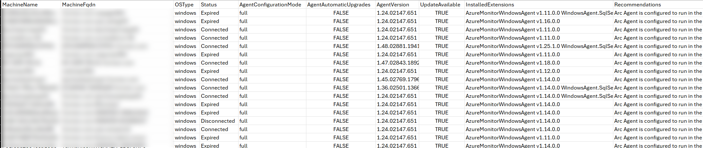

# 🔭 AzArcAudit

AzArcAudit is a comprehensive auditing tool designed to streamline the process of reviewing and optimizing your Azure Arc deployments. It focuses on ensuring that your cloud resources adhere to compliance, security, and performance best practices.

## 🗝️ Key Features
- Audit Azure Arc deployments for compliance and configuration best practices
- Generate detailed reports on resource settings and potential vulnerabilities
- Identify opportunities for optimization and security improvements

## ▶️ Getting Started

### Prerequisites
- Windows PowerShell 5.1 or PowerShell 7+
- [Az PowerShell module](https://learn.microsoft.com/powershell/azure/install-azure-powershell)
- Azure subscription with appropriate permissions to access Arc resources

### Installation
Clone the repository:

```powershell
git clone https://github.com/h0ffayyy/AzArcAudit.git
```

### Usage
Navigate to the project directory and run the audit script:

```powershell
.\AzArcAudit.ps1
```

## 📃 Example Output

The screenshot below shows an example of the report output:



The table below describes each column:

| **Column Name**              | **Description**                                                                                                   |
|------------------------------|-------------------------------------------------------------------------------------------------------------------|
| **MachineName**              | The hostname or identifier of the machine.                                                                        |
| **MachineFqdn**              | The fully qualified domain name of the machine.                                                                   |
| **OSType**                   | The operating system type (e.g., Windows, Linux, macOS).                                                          |
| **Status**                   | Current state of the machine’s agent (e.g., Connected, Expired, Disconnected).                                    |
| **AgentConfigurationProfile**| Name or identifier of the configuration profile applied to the agent.                                             |
| **AgentAutomaticUpdates**    | A Boolean or flag indicating whether automatic updates for the agent are enabled (TRUE/FALSE).                    |
| **AgentVersion**             | The version number of the agent software installed on the machine.                                                |
| **UpdateAvailable**          | A Boolean or flag indicating whether an update is available for the Arc Agent (TRUE/FALSE).                       |
| **InstalledExtensions**      | A list of extensions or plugins that are currently installed on the agent.                                        |
| **Recommendations**          | Suggested actions or next steps based on the machine’s agent status or configuration.                             |

## 🤝 Contributing
Contributions are welcome! Please fork the repository, create a branch for your feature or bug fix, and open a pull request. For significant changes, please open an issue first to discuss your approach.

## 🪪 License
This project is licensed under the MIT License. See the [LICENSE](LICENSE) file for details.
